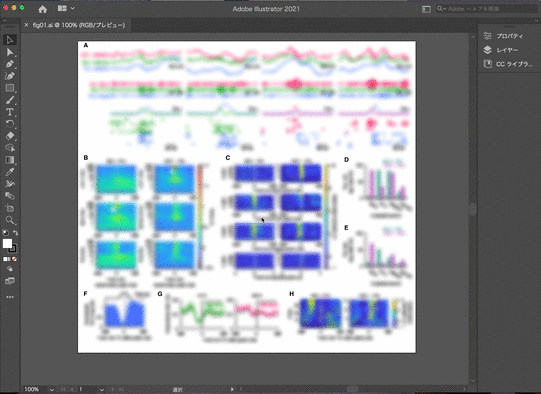

# addFigTitle
Illustrator script to add figure title on top/bottom

The script exapand the active document by 10 mm (assuming 72 dpi) and add document name.

If you are using mac, adding keyboard shortcut with SPAi boosts its usability.  
SPAi: https://tama-san.com/spai/

